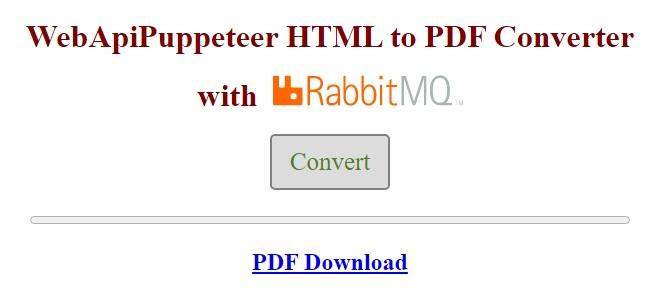

# WebApiPuppeteerRabbitMQ

Веб-сервис написанный на C# с помощью ASP.NET Core 6 Web API.

Конвертирует HTML файлы в PDF файлы, используя [Puppeteer Sharp](https://www.puppeteersharp.com/index.html) и [RabbitMQ](https://www.rabbitmq.com/).

В составе 2 решения (WebApiPuppeteerRabbiMQ и HtmlToPdfWorkerRabbitMQ), которые запускаются и выключаются отдельно.

Для работы необходим запущенный в Docker сервер RabbitMQ:
```ps
docker run -p 5672:5672 -p 15672:15672 rabbitmq:3.11.6-management-alpine
```

При запуске WebApiPuppeteerRabbiMQ в браузере автоматически открывается JavaScript клиент.

#



#

Как это работает:

1.  Клиент отправляет файл POST запросом на http://localhost:5114/converter (FormData object).
2.  Веб-сервис отправляет файл в RabbitMQ очередь -queue.toworker-, добавляя у его имени уникальный id (Guid структура) и отсылает id браузеру.
3.  HtmlToPdfWorkerRabbitMQ получает HTML файл с очереди -queue.toworker-, конвертирует его в PDF файл с помощью Puppeteer Sharp и отправляет его в очередь -queue.fromworker-.
4.  Веб-сервис сохраняет PDF файл из очереди -queue.fromworker- на диск, используя для этого IHostedService.
5.  Клиент каждую секунду проверяет готовность файла и, когда он готов, добавляет на экран  ссылку для скачивания. (например http://localhost:5114/converter/622c42ce-6cb4-4baf-b25f-4dbea7ca038d)
6.  При скачивании веб-сервис убирает из имени файла уникальный id и затем удаляет его.

Такая реализация позволяет клиенту получить файл даже если веб-сервис, RabbitMQ сервер или конвертер перезагрузится. (Exchanhe и Queue создаются с установленным параметром durable).

Заметки:

Первая конвертация может происходить 15-20 секунд, так как HtmlToPdfWorkerRabbitMQ 
The first conversion request can take 15-20 seconds because Puppeteer Sharp is downloading a local version of the Chromium browser.

Использовалась Microsoft Visual Studio 2022.
